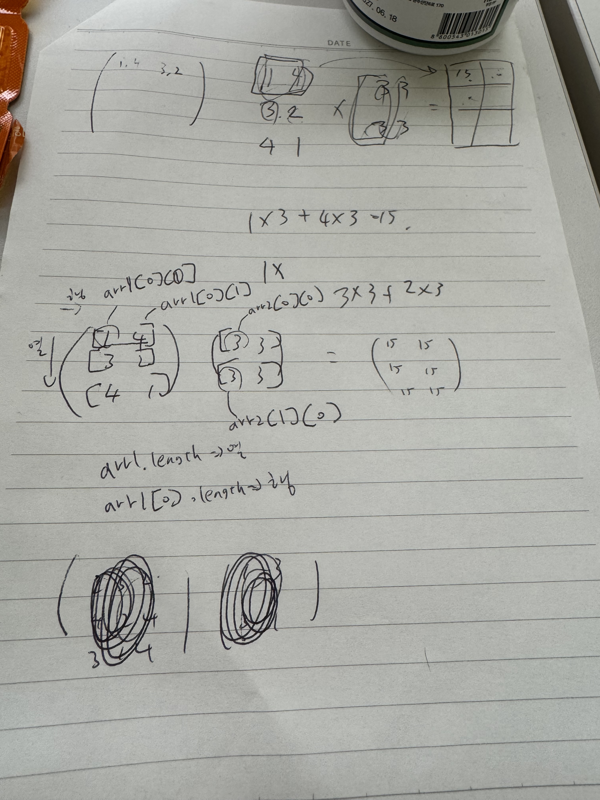

# 📝 알고리즘 문제 풀이 - 2025-07-04

## 문제 📖

- **문제 링크:** [프로그래머스 - 행렬의 곱셈](https://school.programmers.co.kr/learn/courses/30/lessons/12949)

- **문제 유형:** (연습문제)

- **난이도:** (예: Lv.2)

- **풀이 시간:** ⏳ (15분)

## ✍ 접근 방식

- 행렬의 곱셈 방법 자체를 까먹어서 우디한테 수학 과외 받음 ㅋㅋ
- 오랜만에 학창시절 생각나고 좋네요



- 첫 번째 행렬을 arr1, 두 번째 행렬을 arr2로 놓고 하나하나 대입해보니 for문 중첩으로 풀 수 있겠다는 생각을 했습니다.

- 다른 사람의 풀이를 보고 기겁했습니다. 이런 생각은 어떻게 하는 걸까요?

```js
function productMatrix(A, B) {
  return A.map(function (row) {
    return row.map(function (_, i) {
      return row.reduce(function (sum, cell, j) {
        return sum + cell * B[j][i];
      }, 0);
    });
  });
}
```
