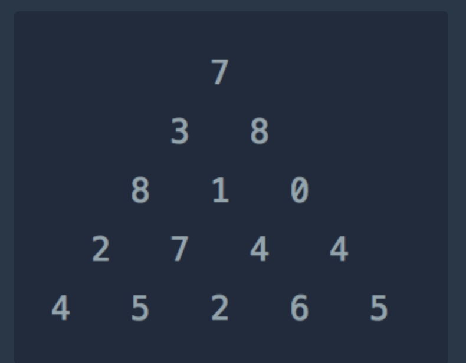

# 📝 알고리즘 문제 풀이 - 2025-07-20

## 문제 📖

- **문제 링크:** [프로그래머스 - 정수 삼각형](https://school.programmers.co.kr/learn/courses/30/lessons/43105)

- **문제 유형:** (DP)

- **난이도:** (LV.3)

- **풀이 시간:** ⏳ (예: 40분)

## ✍ 접근 방식

- 아래서부터 최대 합을 계산해서 위로 올라가기 (참고 이미지)
- 
