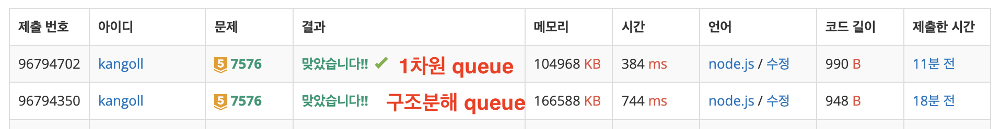

# 📝 알고리즘 문제 풀이 - 2025-07-27

## 문제 📖

- **문제 링크:** [백준 - 토마토](https://www.acmicpc.net/problem/7576)

- **문제 유형:** (그래프)

- **난이도:** (골드5)

- **풀이 시간:** ⏳ (예: 60분)

## ✍ 접근 방식

- 전체 배열 순회하면서 1인 지점을 찾기 O(MxN)

  - 값이 1인 지점이 있다면 queue에 Push 하기 + 초기 `count = 0`

- bfs : queue.pop() 하면서 m,n,count 가져오기.
  - 오른쪽,왼쪽,위,아래의 index가 유효한지 검사 + 배열에서 (m,n)의 값이 0인지 확인
  - (m,n)이 0이라면 방문 안한거라 1로 바꾸고 queue에 `count+1` 해서 push
  - queue가 빌때까지 반복

## 깨달은 점

1. 처음 제출할때 시간초과뜸

원인 : `array.shift()`

- 이친구 착한 친군줄 알았는데 알고보니까 배열 맨 처음 요소 제거하고 뒤에 있는 값들을 전부 한칸씩 옮기는 무시무시한 친구였음
- 이거땜에 시간초과걸림 ;;
- 해결법 -> queue[head++] 하면서 그냥 index만 증가하는 방식으로 변경함. 근데 마음엔 안듦 ...

---

2.  `map((num) => Number(num))` 이거 `map(Number)` 이거랑 똑같음!!

---

3. 700ms -> 300ms로 시간 절약 Tip

- 처음에 700ms가 나와서 시간이 너무 오래 걸린다 생각했다.
- 다른 사람 제출한 코드 보니까 300ms-400ms까지 나오길래 난 왜이렇게 시간 오래걸리지! 하고 찾다보니 이유를 알게됨
- `queue.push([m, n, count + 1]);` 이거랑 `queue.push(m, n, count + 1);` 이거 두개 차이였음

**첫번째 방법**

```JS
// 배열로 push
queue.push([m, n, count + 1]);

// 구조분해 할당
const [m, n, count] = queue[head++];
```

- 가독성 좋고 간결함. 하지만 추가적인 연산 비용이 있음

  - 배열을 메모리에 생성 ([m, n, count])
  - 메모리 참조로 값을 각각 꺼냄
  - 각각의 로컬 변수에 순차적으로 대입

<br/>

**두번째 방법**

```js
// 1차원 배열로 push
queue.push(m, n, count + 1);

// 개수만큼 일일이 pop
const m = queue[head++];
const n = queue[head++];
const count = queue[head++];
```

- 코드가 좀 길어보일지라도
  - 객체/배열 생성 없이 단순 값 복사만 수행 → 빠름
  - GC(가비지 컬렉션) 부담도 없음
  - 구조 분해보다 확실히 효율적

> 별 차이 없을 줄 알았는데 400ms 가까이 시간을 줄임!!
>
> 
>
> **유의미한 시간 변화였나요? 에 대한 대답**
> | 입력 크기 | 구조 분해 방식 | 최적화 방식 |
> | --------- | ---------------- | --------------- |
> | 10만 칸 | 700ms | 300ms |
> | 30만 칸 | 2100ms (❌ 초과) | 900ms (✅ 통과) |
>
> 현재 입력 크기에서는 400ms 차이일 수 있지만,<br/>
> 입력 크기가 2배, 3배로 증가하면 → 차이는 초 단위로 커질 수 있음.
